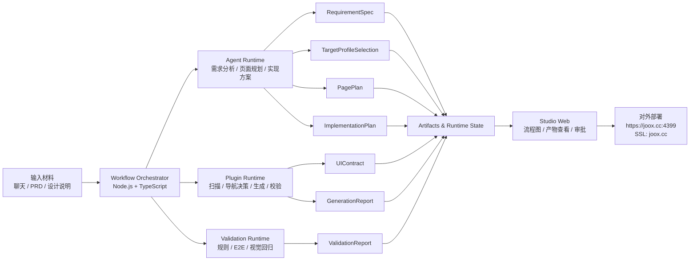

# 全局架构与研发进度总览

## 部署入口

- 访问地址：`https://joox.cc:4399`
- 证书策略：复用 `joox.cc` 的 SSL 证书
- 对外形态：单域名 + 指定端口，承载 Studio Web、API 反向代理与运行态可视化入口
- 路径聚合：`/` -> Studio Web，`/api/` -> API，`/events/` -> SSE，`/ws/` -> WebSocket

## 当前研发进度

- Phase 1：已完成
- Phase 2：核心骨架已完成，正在把诊断型验证器升级为真实执行器
- Phase 2.5：Agent Runtime 已接入（LLM 驱动的 skill 执行）
- Phase 2.6：交互式需求对话 + 需求完整度评分 + 设计稿生成 + 代码生成 Skill
- Phase 2.7：UI 组件库选择系统 (8 个库，Vue3 + React)
- Phase 3a：Studio Web + API 已启动 (localhost:4400 + localhost:4401)
- Phase 3b：未开始，聚焦运行历史、审批闸门、部署
- Phase 3：未开始，聚焦可视化、artifacts、运行历史、审批闸门
- Phase 4：未开始，聚焦修复回流、视觉基线、多 profile 扩展

## 全局架构流程图

## 研发进度映射

### 已完成

- 工作流加载、校验、最小 runner
- schema / policy / target profile 注册表
- `project-scanner`
- `navigation-decider`
- `page-generator`
- `validation-core`
- 规则检查器：loading / debounce / 删除确认
- 诊断型 `playwright-runner`
- 诊断型 `visual-regression-runner`
- Agent Runtime：LLM 客户端 + Agent Runner + 4 个 Skill 定义
- `llm-runner.ts`：真实 LLM 驱动的工作流执行入口
- 支持 Xiaomi MiMo / OpenRouter / 任意 OpenAI 兼容端点
- 交互式需求对话 Skill (interactive-requirement)：多轮对话 + 完整度评分
- 设计稿生成 Skill (design-generation)：输出自包含 HTML 设计稿
- 代码生成 Skill (code-generation)：从需求文档直接生成完整代码
- `interactive-runner.ts`：交互式 CLI 入口
- UI 组件库目录 (ui-catalog.ts)：Element Plus / Ant Design / Naive UI / Vuetify / Arco Design / HeroUI 等 8 个库
- `ui-library-selection` Skill：根据框架和需求推荐 UI 库

### 进行中

- 将诊断型验证器升级为真实执行器
- 让 artifacts 从“报告对象”升级为“文件系统产物 + 可视化查看”

### 待开始

- Studio 运行详情页
- 人工审批闸门
- 视觉基线管理
- 多 profile 深化适配
